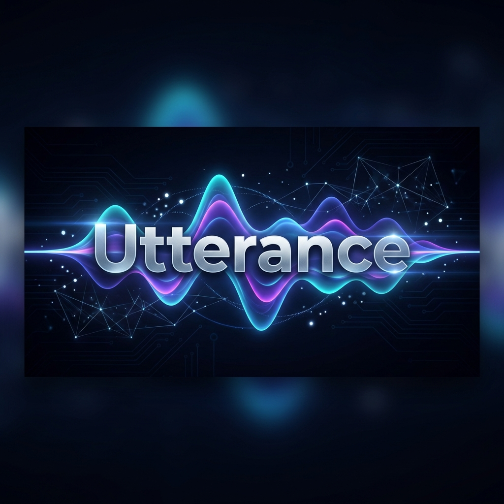

<div align="center">



# Utterance
**The Ultimate Speech-AI Pipeline for iOS & macOS**

[](https://github.com/sownhere/Utterance/actions)
[](https://swift.org)
[](https://developer.apple.com/swift/)
[](https://sownhere.github.io/Utterance/documentation/utterance)
[](LICENSE)

**Utterance** is a modular, high-performance SDK that transforms how your apps listen, understand, and speak. Built for the modern AI era, it empowers developers to integrate complex speech pipelines with just a few lines of code.

[Features](#-features) • [Installation](#-installation) • [Usage](#-usage) • [Documentation](https://sownhere.github.io/Utterance/documentation/utterance) • [Contributing](#-contributing)

</div>

---

## 🚀 Features

| Module | Feature |
|:---:|---|
| **🎙️ Audio Engine** | Low-latency recording with automatic silence detection, volume monitoring, and ring-buffer architecture. |
| **📝 Transcription** | Real-time Speech-to-Text with support for streaming results and statement-based grouping. |
| **🌍 Translation** | On-the-fly translation bridging language barriers seamlessly. |
| **🎨 Visualizer** | Drop-in **Siri-style** waveform components to dazzle your users. |
| **🧩 Modular** | Import only what you need: `UtteranceAudio`, `UtteranceTranscript`, or the full Suite. |

## 📦 Installation
Utterance is distributed via **Swift Package Manager**.

### The Full Suite (Recommended)
Add the package to your `Package.swift`:

```swift
dependencies: [
    .package(url: "https://github.com/sownhere/Utterance.git", from: "1.0.0")
],
targets: [
    .target(name: "MyApp", dependencies: [
        .product(name: "Utterance", package: "Utterance")
    ])
]
```

### Modular Import (For Optimization)
Only need the audio engine? No problem.
```swift
.product(name: "UtteranceAudio", package: "Utterance")
// Available: UtteranceAudio, UtteranceTranscript, UtteranceTranslation
```

## 🛠 Usage

### 1. Basic Recording
```swift
import Utterance

// Start recording with one line
let task = try await UT.record(.default).run()

print("File saved at: \(task.fileURL)")
```

### 2. Live Transcription & Visualizer
```swift
import Utterance
import SwiftUI

struct DictationView: View {
    @StateObject var viewModel = RecordingViewModel()

    var body: some View {
        VStack {
            // Beautiful Siri-like Waveform
            SiriWaveformView(audioLevel: viewModel.audioLevel)
            
            Text(viewModel.liveText)
        }
    }
}
```

### 3. File Transcription
```swift
// Transcribe an existing audio file
let fileURL = Bundle.main.url(forResource: "interview", withExtension: "m4a")!

let request = try await UT.transcribe(
    file: fileURL, 
    configuration: .english
)
.onProgress { progress in
    print("Progress: \(Int(progress.percentage * 100))%")
}
.run()

print("Full Text: \(request.text)")
```

### 4. Export Data (SRT, VTT, JSON)
```swift
import Utterance

// Export transcript items to standard formats
let items = result.segments.map { ... } 
let srtURL = try TranscriptExporter.export(
    items, 
    to: .srt
).write(to: tempURL)

print("Exported to: \(srtURL)")
```

## 🤝 Contributing

We love contributions! Please read our [Contributing Guide](CONTRIBUTING.md) to get started.

1. Fork the Project
2. Create your Feature Branch (`git checkout -b feature/AmazingFeature`)
3. Commit your Changes (`git commit -m 'Add some AmazingFeature'`)
4. Push to the Branch (`git push origin feature/AmazingFeature`)
5. Open a Pull Request

## 📄 License

Distributed under the MIT License. See `LICENSE` for more information.
